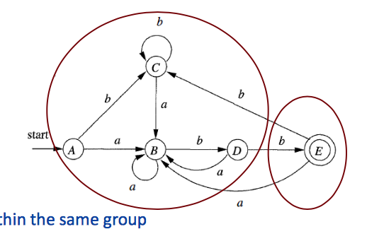
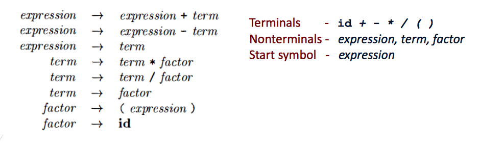
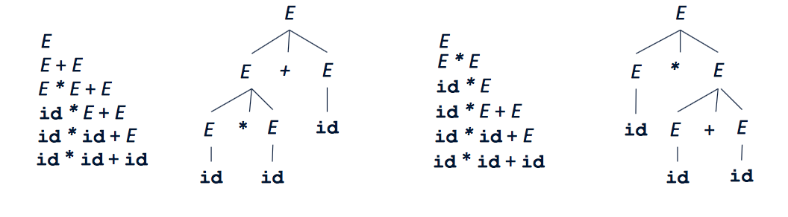

#### **Lecture 1** – October 4th, 2017

Missed...

#### **Lecture 2** – October 6th, 2017

## **Part 1** Lexical Analyzer (Lexing)

[Slides](./lexing.pdf)

#### **Lecture 3** – October 9th, 2017

## DFA to minimal DFA: Hopcroft's algorithm

1. Given $D$ states in the DFA partition the states into two groups – $F$ and
   $S-F$, the *accepting states* and the *nonaccepting states*. Denote this
   initial partitioning as $P = F$, $S-F$.
2. Let new partitioning $P_{new} = P$  
   For each group $G$ in $P_{new}$  
   	partition into subgroups such that two states $s$ and $t$ are in the same
   	subgroup if and only if for all input symbols $a$



## **Part 2** Syntax Analyzer (Parsing)

### Overview

- Context free grammars (CFGs) – formal mechanism for
  - specifying the syntax of the source language and
  - a systematic method of determining membership in this formally specified
    language
  - we use context-free grammars to specify the grammatical structure of
    programming languages.

- Algorithms for doing this:
  - Top-down parsing – $LL(1)$ and recursive descent parsers.
  - Bottom-up parsing – $LR(1)$ parsers, canonical $LR(1)$ parsers, LALR parser.

Regular expressions are not sufficiently powerful to represent context-free
structures. It doesn't understand recursion, for example.

## Context Free Grammars (CFGs)

### Formally

- $T$ – A set of *terminal symbols*
- $NT$ – A set of *nonterminals*
- $S$ – A designation of one of the nonterminals as the *start symbol*
- $P$ – A set of *productions*, where each production consists of a
  nonterminal, called the *head or left side* of the production, an
  arrow and a sequence of terminals and/or nonterminal, called the
  *body or right side* of the production.




### Backus-Naur form (**BNF**)

```
&lt;SheepNoise&gt; ::= baa &lt;SheepNoise&gt;
               | baa
```

- Nonterminal symbols wrapped in angle brackets `<SheepNoise>`
- Terminal symbols underlined.
- The symbol `::=` means "derives," and the symbol `|` means "also derives“

### Ambiguous Grammars

Consider the grammar: $E \rightarrow E + E | E \ast E | (E) | \text{id}$

Now consider the input: `id * id + id`

This input can be derived in two different ways:



#### **Lecture 4** – October 12th, 2017

#### **Lecture 5** – October 13th, 2017

#### **Lecture 6** – October 16th, 2017

#### **Lecture 7** – October 19th, 2017

#### **Lecture 8** – October 20th, 2017

#### **Lecture 9** – October 23rd, 2017


