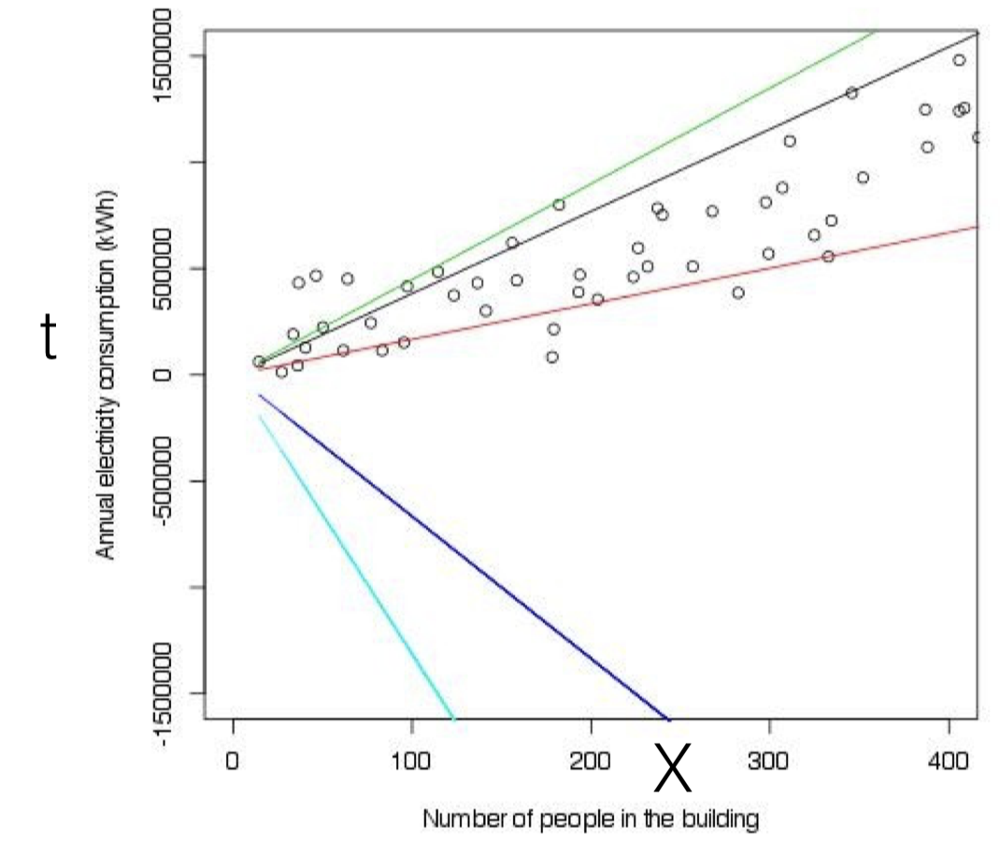

#### **Lecture 1** – January 8th, 2018

Ask questions on the Machine Learning forum, if you can, instead of emailing Theo directly.

### Assessment

- Final Exam (60%), based on lecture material & PPs & worksheets

- Coursework (40%):
  - First assignment (15%).
  - Second assignment (25%), on a real-world ML competition platform.

### Syllabus

- **A First Course in Machine Learning**, 2nd Edition, S. Rogers & M. Girolami
- **Machine Learning**, T. Mitchell

### How does one learn?

- **Supervised learning**
  - Direct feedback: car is blue, car is red, car is red, etc...
  - Indirect reward feedback: better, worse, hot cold, etc... (e.g. dopamine)
- **Unsupervised learning**
  - Creating clusters or groups, finding patterns in data with no
    direct goal for what constitutes the right pattern to spot.

### The common goal of ML systems

- They learn from data (*"experience"* ).

- A computer program is said to learn from experience *E (data)* with respect to some class of tasks *T* and performance measure *P*, if its performance at tasks in *T*, as measured by *P*, improves with experience *E*.

### Main subfields of ML

- Supervised
  - Regression
  - Classification
  - Ranking
  - Structured Prediction
- Unsupervised
  - Clustering
  - Dimensionality Reduction (100x100 image is a vector in a 10000 dimensional space, which needs to be reduced to work with)
  - Manifold Learning
- Reinforcement
  - Markov Decision Process (e.g. Robotics)
  - Multi-Agent Systems
  - TD/Q-Learning (State-Action-Reward)

### Regression

#### **Lecture 2** – January 11th, 2018

Conventionally, in Computer Science, you have your *program* and *input* as input to the computer, and you have your *output* as output. With supervised learning, you have your *input* and *output* as input, and you have your *program* as output.

Hypotheses: the relationship between X and t is **linear**.

$$\hat{t} = f(x;w_0,w_1) = w_0 + w_1 x$$

What are the best parameters? Somewhere between the black and the red line $\Rightarrow$ we must have a measure of goodness of fit that we try and maximize.

**To generalize:**

Data: input $\textbf{X}$ / outputs $\textbf{t}$.  
Parameters: $\textbf{w}$.  
Hypothesis space: $f(x; \textbf{w}) : x \rightarrow t$.  
"Goodness" metric: e.g. the distance between $f(x,\textbf{w})$ and $t$.

**Note:** you don't have to run your learning algorithms on the *raw* input. By intelligently preprocessing raw data so that you end up with a smaller feature set, you can end up with a more effective result. The concept of creating features from inputs is called *feature engineering*.

### Goodness metrics

Squared loss: $\mathcal{L}_n(t_n,\hat{t}_n) = (t_n - \hat{t}_n)^2$  
Absolute difference: $\mathcal{L}_n(t_n,\hat{t}_n) = |t_n - \hat{t}_n|$

$\mathcal{L} = \frac{1}{N}\sum^{N}_{n=1}\mathcal{L}_n = \frac{1}{N}\sum^{N}_{n=1}(t_n - f(x_n;\textbf{w}))^2$

So, what we're looking for:

$\hat{\textbf{w}} \leftarrow \textrm{argmin}_\textbf{w}\frac{1}{N}\sum^{N}_{n=1}(t_n - f(x_n;\textbf{w}))^2$

Approach:

1. Replace the expression $f$ with a specific loss function.
2. Equate first derivative of loss to zero to get $\textbf{w}$ (find potential minima).
3. Examine second derivative of loss at $\textbf{w}$ to determine if unique minima.

#### **Lecture 3** – January 12th, 2018

Missed.

#### **Lecture 4** – January 15th, 2018

Missed.

#### **Lecture 5** – January 18th, 2018

Euclidean vs. Manhattan distance.

Manhattan: you can't walk diagonally (as the crow flies).

With Manhattan distance, when deciding on boundaries based on distances to points, you may end up with boundaries which are equidistant to two points.

## **Distance-weighted k-NN**

- Weigh the vote of each neighbour by its distance to the observation. The further away it is, the less it gets counted for.
- Can help break ties when k is even.
- Can help deal with <u>noisy data</u> and <u>outliers</u>

$t^* \leftarrow \frac{\sum_{i=1}^{k} w_i t_i}{\sum_{i=1}^{k} w_i}$

$w_i = \frac{1}{d(\textbf{x}_i,\textbf{x}^*)^2}$

#### **Lecture 6** – January 19th, 2018

Missed lecture.
