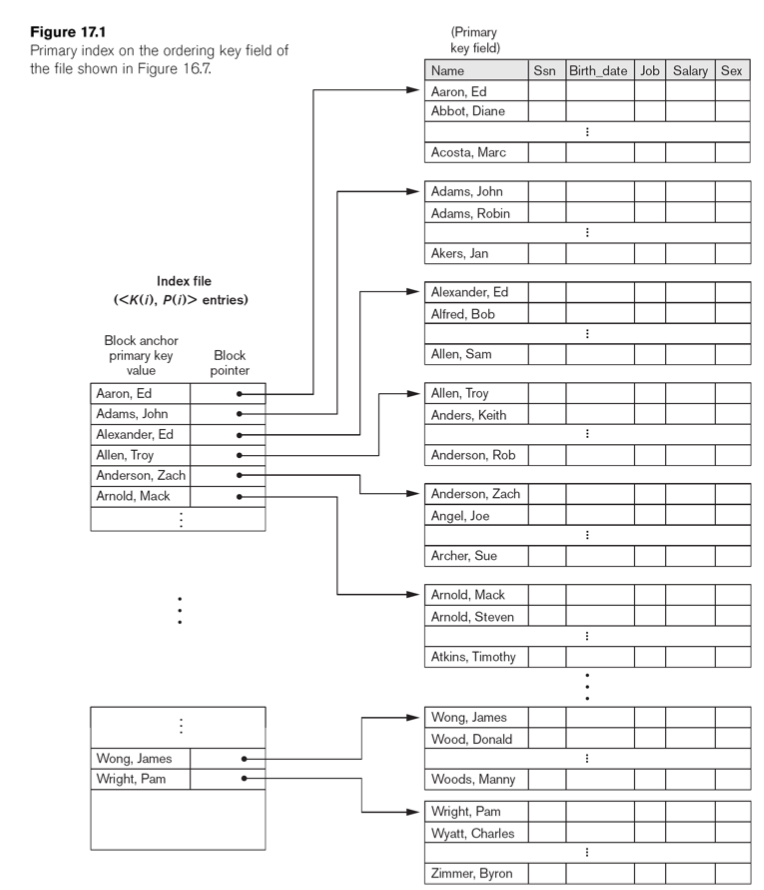
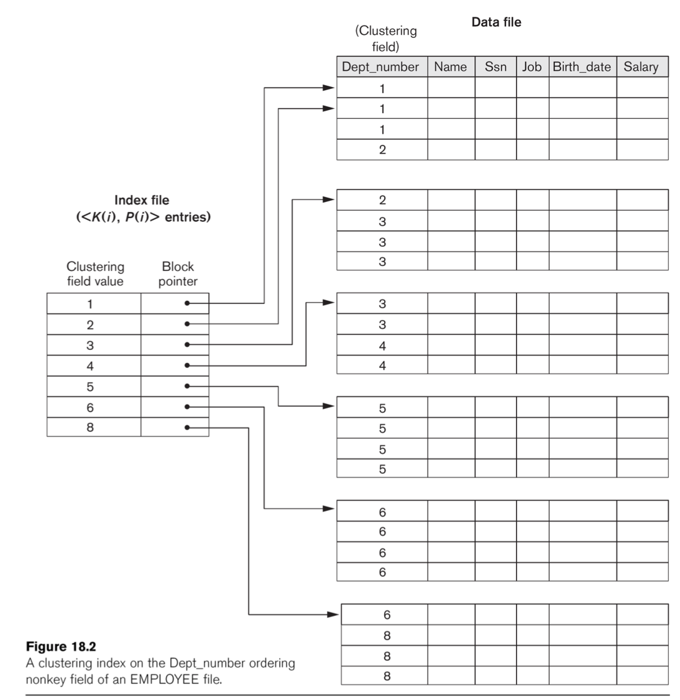
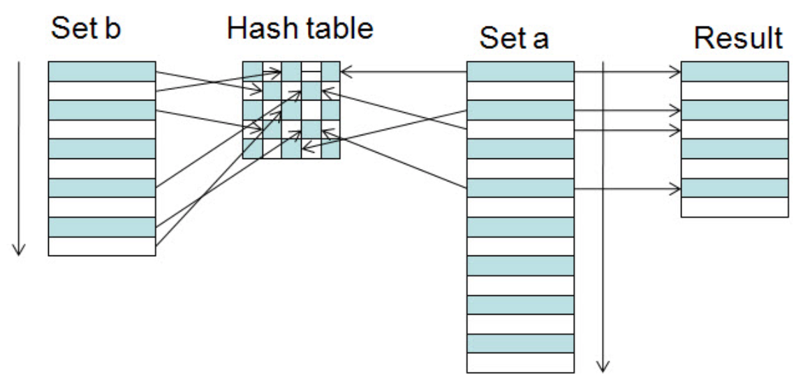

#### **Lecture 1** – October 5th, 2017

Significant part of the module: the back-end of databases. Other part: recent
development in db tech.

In other words: 60% is data structures, 40% is operating systems.

For db performance, we care about I/O ops since db's are usually stored on
disk and not in memory. We optimise algorithms to minimise I/O ops involved.
Clock cycles, or CPU comparisons are relatively cheap by comparison.

**CS258 Recap...**  
CS258 was application design: start with a companies needs, construct E/R
diagrams, which later become tables in a relational database.

The relational model was invented by Cod at IBM. SQL became the standard for
querying relational models.

**This modules...**  
The back-end. How do you provide for the application guys from CS258?

Things that we discuss include:

- B-trees (n-ary balanced trees)
- multiple indices: querying multiple attributes simultaneously
- external hashing: hash points to different blocks on disk
- order of joins: what do you join first?

$$
ABC \rightarrow (AB)C | A(BC)
$$

- OLAP: Can I change this relational model to make it more fit for analysis?
- Teradata: data warehousing company.

#### **Lecture 2** – October 6th, 2017

## Why use RDBMS

- **Controlling redundancy**  
  Redundancy causes inconsistencies in the data, update costs, and storage
  overheads. Recent technologies aim to make data consistent, however the
  updates must be available eventually.

- **Concurrency Control**  
  DBs control concurrency themselves (not relying on the OS) to make sure
  the data can be accessed concurrently.

- **Backup and Recovery**  
  In case of errors, roll back to the last consistent state.

- **Views, Access Control**  
  Different people can see different parts of the database.

- **Standardization (SQL)**  
  Use the same language for querying irrespective of the underlying
  database technology.

## When *not* to use a RDBMS?

Small dataset, model doesn't change often, simple application.

# **Relational databases**

- Relational model
  - Relational Data Structures
  - Integrity Rules

- Query languages
  - Relational Algebra (useful for running queries efficiently)
  - Relational Calculus
  - SQL

## Keys

- A relation is a **set** of tuples. All elements of a set are distinct.

- Hence **all tuples must be distinct**.

- There may also be a **subset of the attributes** with the property that
  values **must** be distinct.  
  Such a set is called a ***superkey***.
  - $SK$ a set of attributes
  - $t_1$ and $t_2$ tuples
  - $t_1[SK] \neq t_2[SK]$

- A ***candidate key*** is a minimal super key.
  - A set of attributes, $CK$ is a superkey,
  - but no proper subset is a superkey.

- A ***primary key*** is one *arbitrarily chosen candidate key*.

## Integrity Rules

- **Domain contrainsts** A data type for each item.

- **Entity integrity:** Every relation has a valid primary key.

- **Referential integrity:** if one column is a foreign key to another table,
  if a row has a non-null value as the column, it MUST exist in the foreign
  table.

## Normalize

(...show tables from slides)

# **Storage, Files, and Indexing**

## Outline

**Part 1**
- Disk properties and file storage
- File organizations: ordered, unordered, and hashed
- STorage: RAID and storage are networks

- Chapter: "Dist Storage, Basic File Structures and Hashing"

## Why?

Locality: similar objects in the same block
Parallelism: if there are too many objects to fit in one block, spread them
over many servers, clustered in the same block within each server.

Bottom-up perspective on data management.

## Data on Disks

- Databases ultimately rely on non-volatile disk storage
  - Data typically does not fit in (volatile) memory
- Physical properties of disks affect performance of the DBMS
  - Need to understand some basics of disks

- A few exceptions to disk-based databases:
  - Some real-time applications use "in-memory databases"

## Rotating Disk

- Seeking means waiting for your sector of data to come round to the reading
  arm. Once you get there you want to do sequential I/O, not random I/O.

- Too tidy sequential I/O: more data comes along and everything has to be
  shifted forwards.

- When writing your DB application, you fit your block size to be reasonable.
  Say, 16MB.

- Seek time: move read head into position, currently $~4ms$
  - Includes rotational delay: wait for sector to come under read head.
  - Random access: $1/0.004 * 4KB = 1MB/s$. Quite slow...

- Track-to-track move, currently $~0.4ms$: 10 times faster.
  - Sustained read/write time: $100MB/s$ (caching can improve this further)

- Buffering can help multithreaded systems.
  - Work on other processes while waiting for I/O data to arrive.
  - For writing on disk, fill a buffer first. When the buffer is full, then
    write to disk.
  - Double buffering: fill one buffer whilst another is being written to disk.

## Records: the basic unit of the database

- DBs fundamentally composed of records
  - Each record describes an object with a number of fields
- Fields have a type (int, float, string, time, compound...)
  - Fixed or variable length
- Need to know when one field ends and the next begins
  - Field length codes
  - Field separators (special characters)
- Leads to **variable length records**
  - How to effectively search through data with variable length records?

#### **Lecture 3** – October 9th, 2017

## Records and Blocks

- Records get stored on disks organized into blocks
- Small records: pack an integer number into each block
  - Leaves some space left over in blocks
  - Blocking Factor: (average) number of records per block
- Large records: may not be effective to leave slack
  - Records may span across multiple blocks (spanned organization)
  - May use a pointer at end of block to point to next block

## File Organization

- File: Sequence of records
  - Fixed-length vs. variable-length records
- Records are stored to disk blocks
  - Spanned vs. unspanned
- Blocks are allocated to disk
  - Contiguous vs. Linked allocation
- File Organization
  - Unordered
  - Ordered
  - Hashing

### Unordered Files

- Just dump the records on disk in no particular order
- Insert is very efficent: just add to last block
- Scan is very inefficient: need to do a linear search.
  - Approx. read half the file on average
- Delete could be inefficient

### Ordered Files

- Keep records ordered on some (key) value

### Hashing Files

- Use hashing to ensure records with same key are grouped together
- Arrange file blocks into M equal sized buckets
  - Often, 1 block = 1 bucket
- Usual hash table concerns emerge
  - How to deal with collisions?
  - Deletions also get messy

- **External hashing**: don't store records directly in buckets, store
  pointers to records.
  - Pointers are small, fit more in a block
  - "All problems in computer science can be solved by another level
    of indirection" – *David Wheeler*

### External Hashing for Disk Files

- **Bucket**: One disk block or cluster of contiguous blocks (like
  fixed-size chaining)
- Hashing maps a key to a bucket number (which is then mapped to a
  physical block)

### Dynamic Hashing

- Static hashing: hash address space is fixed.
- Dynamic hashing: Expand and shrink the hash space.

### Extendible Hashing

For a table of size 2: use most significant bit for hash.

**TODO**: This is complicated. Write out a full description for this later.

#### **Lecture 4** – October 12th, 2017

**Points to Note**

- Does the order of insertion matter?  
  Not in this case. But in most cases we are inserting multiple rows at a time
  anyway. This is called **bulk loading**, where you find a way to efficiently
  insert reams of data instead of inserting tuples one by one.

- Bucket split causes directory doubling
  - If local depth becomes > global depth

### Linear Hashing: Example

# **Indexing**

**Aims**
- Generate a smaller file, by having an index of an index.

## Primary Index

Can be **dense** or **sparse**. A sparse index has only a selection of tuples
with which you can find the other tuples.

- Single-level Ordered Indexes
  - Primary Indexes
  - Clustering Indexes
  - Secondary Indexes

- Multilevel Indexes

- Dynamic Multilevel Indexes
  - B-Trees, B+-Trees

- Indexes on Multiple Keys

To allow insertions you need to leave empty space in buckets. However, less
entries in each block means you have more IO operations.

Another alternative is **overflow**. If a block is full, have a chain to a
secondary block instead of shifting all data along blocks. Overnight you can
run through the data and rebuild an index.

Or you can keep an insertion table (in memory). Don't insert tuples into the
index immediately. Once in a while you can bulk insert the tuples into the
index and rebuild the index.

Most the time you don't want to reorganise the index. If you delete "Bob
Alfred", mark it as deleted instead of removing from the index.

## Clustering Index

- Insertion is a challenger in the previous version.
- Cluster index where each distinct value is allocated a whole disk block
- Linked list if more than one block is needed
- Easier to update file with inserts/deletes

## Secondary indexes

- Secondary indexes provide a **secondary** means of access to data

These are dense indexes with references to blocks. Not good for insertions,
deletions. But extremely good for existence queries (0 IO operations to figure
out if $x$ is in your table.)

## Indexes on non-key columns

- Keep multiple entries for the same value in the index
- One entry per value, points to block of pointers that point to all the rows
  with that value.

## Two-level index / Multi-level indexing

Bottom-up perspective: we have a big file, we want to search the file. So we
need an index that's sorted, and we want to navigate that index quickly. So we
build an index of the index, and we end up with a tree.

#### **Lecture 5** – October 13th, 2017

Missed...

#### **Lecture 6** – October 13th, 2017

Made no notes...

#### **Lecture 7** – October 19th, 2017

## Bulk insertion

Insertion order is important in B+ trees. What if the data to be inserted is
sorted? What will the tree look like at the end? When you insert your data in
order you end up with a B+ tree that is very empty (minimally empty in fact).

This can be resolved by calling a `sorted_bulk_insert()` function instead
of a regular `insert()` for each tuple.

For bulk insertion, when you split, don't split the bucket in half. Instead
only bring the greatest element to the new bucket and leave the old bucket
full. This is referred to as **bulk loading**.

Level: 3  
Max-capacity: 11  

Best case:
- $11$ pointers for root
- $11$ pointers for nodes in second level
- $10$ keys for leaf nodes

$$11\times 11\times 10=1210$$

Worst case:
- $2$ pointers for root
- $6$ pointers for nodes in second level
- $5$ keys for leaf nodes

$$2\times 6\times 5=60$$

## Data Storage

**Tuning** tweaking the performance of a query.

Make sure disk speeds are all the same, or be considerate of slower disks.

Handle disk addition and disk removal without turning off the 

Policy constraints
- Duplicate the data in countries that are allowed (w.r.t. data privacy).

Replace cross-data centers
- Always have three different copies of data in separate locations of data
  centre.

The ideal parallelism for a single query is
- Minimal number of parallel scanning servers needed to satisfy the client.

Concurrent queries
- Maximizing parallelism for all of them can cause disk contention, reducing
  everybody's performance.

The goal in data centres is: reach maximal parallelism while minimizing
concurrency issues.

# **Tuning**

**Tuning** tweaking the performance of a query.

Retrieval queries:
1. Which files are accessed by the query?
2. Which attributes is selection applied to?
3. Is the selection equality, inequality or range?
4. Which attributes are subjects of join conditions?
5. Which attributes are retrieved by the query?

Update transactions:
1. The files that will be updated
2. The type of operation on each file (insert, modify, delete)
3. The attributes for selection of a record to delete/modify
4. The attributes whose values will be changed by a modify

Third one is most important.
Need to build an index on attributes from 3, need to avoid index on attributes
from 4, since they change often.

Building an index makes sense in most cases, but you shouldn't have them for
some attributes. For example, for attributes that are modified often.

Attributes with uniqueness (key) constraints should have an index.

`CREATE [ UNIQUE ] INDEX <index name> ON <table name> (<column name> [ <order>
  ] ) `

#### **Lecture 8** – October 23rd, 2017

## External Merge Sort

1. For each block that fits in memory:
   1. Read into disk as much as fits in memory.  
   2. Sort it in memory.
   3. Write it back.

2. Read portions of each sorted block into memory and merge them.

External merge sort:
1. **`122225`**`-234445-11235`
2. `122225-`**`234445`**`-11235`
3. `122225-234445-`**`11235`**
4. **`12`**`2225-`**`23`**`4445-`**`11`**`235`
5. `12`**`22`**`25-23`**`44`**`45-11`**`23`**`5`
6. `1222`**`25`**`-2344`**`45`**`-1123`**`5`**

$3(b_r + b_s) + 1$

## Sort-merge algorithm

- Parameters of the sorting procedure:
  - $b$: number of blocks in the file to be sorted
  - $n_B$: available buffer space measured in blocks
  - $n_R$: number of runs (chunks) of the file produced
    - $n_R = \lceil b/n_B \rceil$

- Small example: $b=1024$, $n_B=5$, need 205 runs of 5 blocks
- After first pass, have $n_R$ sorted pieces of $n_B$ blocks: merge them
  together.
  - In-memory mergesort: merge two at a time (two-way merge)
  - External sorting: merge as many as possible
    - Limiting factor: smaller of $(n_B - 1)$ and $n_R$

## Complicated SELECT operation

Selecting on many indices simultaneously (where the indices are queries
together with `AND` or `OR`).

Get the pointers to the different blocks from the secondary indexes of all of
the queries indices, then... intersect the pointers, *then* access the blocks.

## Selectivity estimation

Knowing the size of the result of a query without having to carry out the
query.

#### **Lecture 9** – October 26th, 2017

## Hands-on projects

1. **Data Warehousing**: SQL, OLAP, from RDBMS to DWs

   - In a data warehouse we have a purpose (e.g. money or sales).
   - You will take this normalised DB and will make it a fact-based or
     subject-based table. You will drop some data. You will have a fact
     table with information about sales, which may refer to secondary tables
     with products, customers, or suppliers.
   - Instructions given step by step: drop these tables, do this, do that...
   - You can use MySQL, PostgreSQL, Oracle, but the queries are done for MS
     SQL Server.
   - OLAP: for example, "give me the no. of products sold in the second half
     of this year in region A that weren't sold in the first half of this year
     in region B."
   - Challenge: data will be missing, e.g. holidays, but they will be queried.

2. **Hadoop MapReduce**: Big Data hacking, text analytics

   - You will be given a very big data set (and small one for testing). It
     will consist of updates to wiki pages.
   - Since it's big, you can't use basic C code (or maybe you can).
   - Process this data to answer questions, e.g: "who was the most active user
     on wikipedia"? Were they genuine edits or spam? Give the top $k$.
   - Or: "what are the articles with the highest number of revisions?"
   - Biggest challenge: install Hadoop. Get it running. There is a step-by-
     step instruction paper on how to install it.
   - Note: using Hadoop on your own machine allows you to gauge the
     performance better, since you have complete control over your threads
     (i.e. fewer context switches).

3. **Column oriented data stores**: Column stores for analytics, bitmaps,
   algorithms

   - We care about aggregates (sums, avgs, analysis).
   - Project is about storing columns in efficient way.
   - Given any DB, how can I store data column-wise?
   - Compression: most-famous one, round-length encoding.
     `[6, 6, 6, 6, 6, 6, 6]` is turned into `6 x 7`, though that only works
     if the column is compressed.
   - It is assumed that the data is compressable. But that may not be the
     case.
   - In this project: sort data on one column so that there are sequences
     of repetitions in the data.
   - I will give you data, you will take the data and compress it, and I
     will give you the compression codes.
   - Don't spend too much time on details, spend time on creative solutions.
   - Complex compression algorithm $\Rightarrow$ slow querying. You must
     compress it such that querying is efficient.
   - Problem: multiple columns, need to sort it in multidimensional way.
   - Provided with 5 data sets, one with 2 million tuples.

## Objectives

- To get hands-on experience in one of the areas.
- To do something timely, and that you find interesting and stimulating.
- To let you pick something that reflects your interests.

## Submission Details

- Submission is via Tabula
  - Upload a PDF of the report
  - Upload a zip of the source code
- Due **Monday 4th of December (12 noon)**
  - Usual late scheme applies: loss of 5% of marks per working day late.
  - Do make use of books/articles/websites, but cite them properly.
  - Don't copy code.

## Report Format

- Report:
  - Max 5 pages (at most 3500 words) for the main part of the report
  - Appendix: for detailed query outputs if required by the project
    description.
- The main part:
  - At least 10pt font, "sensible margins" (2cm on all sides)
  - Some marks go to presentation.
  - Ability to communicate is vital in whatever you go on to do
  - Use graphs and diagrams where applicable.

## Suggested Outline

- Introduction
- Description of what you did
  - Describe the algorithms and implementations
  - Enough detail to allow someone else to repeat the process
  - Include what measures you will measure the methods on
- Results
  - Experimental evaluation
  - "As the data size increases, I have a linear increase in cost, ..."
  - For the column compressions project: "as the number of attributes
    increases these methods start to perform worse, but as the number of rows
    increases these methods become more stable."
- Conclusions/references
  - Include proper references to work you made use of
  - What more could you have done if you had more time?

## Evaluation Criteria

- Quality of solutions and their evaluations [5%]
- Quality of presentation [5%]
- Quality of code, documentation, and instruction [4%]
- Description of the work done and objectives [2%]
- Framing material, references [2%]
- Results and discussion/interpretation [4%]

Report more important than the project. **Keep that in mind**.

#### **Lecture 10** – October 27th, 2017

## **Implementing JOIN**

- **Sort-merge join**:

  - If $R$ and $S$ are physically sorted (ordered) by value of the join
    attributes $A$ and $B$, respectively, sort-merge join is very efficient.
  - Both files are scanned in order of the join attributes, matching the
    records that have the same values for $A$ and $B$.

- **Hash join**:

  - The records of $R$ and $S$ are both hashed with the *same hash function*
    on the join attributes $A$ of $R$ and $B$ of $S$ as hash keys.
  - Hash join is very efficient if one of the sets fits into memory.
    Otherwise, bring as much as you can into memory, hash them, write back.
    Then read in the hashed data and join them.
  - Cost if files don't fit into memory: 3 times as many IOs.
  - Assumed: your hash function behaves nicely, splits data in uniform
    buckets.

## **JOIN performance**

- Nested-loop join can be very expensive

- Joining EMPLOYEE and DEPARTMENT, with EMPLOYEE for the outer loop:  
  EMPLOYEE read once, DEPARTMENT read $b_E/(n_B-2)$ times.
  - Read EMPLOYEE once: $b_E$ blocks
  - Read DEPARTMENT $\lceil b_E/(n_B-2)\rceil$ times: $b_D\times b_E/(n_B-2)$
  - In our examples: $2000+10\times 2000/5=6000$ block reads.
- Joining EMPLOYEE and DEPARTMENT, with DEPARTMENT for the outer loop:  
  EMPLOYEE read once, DEPARTMENT read $b_E/(n_B-2)$ times.
  - Read DEPARTMENT once: $b_D$ blocks
  - Read EMPLOYEE $\lceil b_D/(n_B-2)\rceil$ times: $b_E\times b_D/(n_B-2)$
  - In our examples: $10+2000\times 10/5=4010$ block reads.

## **JOIN selection factor**

## **Sort-merge JOIN efficiency**

## **Partition hash JOIN**

## **PROJECT operation**

## **SET operation**

- Other operations: UNION, INTERSECTION, SET DIFFERENCE. These are easy.
  Sort the data, run the operation.

## **Aggregate operation**

- Aggregates: MIN, MAX, COUNT, AVERAGE, SUM. Keep track of these values and
  update the aggregates on insertion and updates.

## **GROUP BY**

- `SELECT Dno, AVG(Salary) FROM EMPLOYEE GROUP BY Dno`  
  Apply the aggregate separately to each group of tuples

## **Avoid hitting the disk: pipelining**

- It is convenient to think of each operation in isolation.
  - Read input from disk, write results to disk.

- However, this is very slow: very disk intensive.

- Use pipelining: pass results of one operator directly to the next, like
  unix pipes `FIRST QUERY | SECOND QUERY`

## Example

`SELECT B,D FROM R,S WHERE R.A = "c" AND S.E = 2 AND R.C = S.C`

**How do we execute query?**

**Plan I**: Cartesian product, then selection (may be a large cartesian product)

**Plan II**: Take first table, do a selection, take second table, do a selection,
then join.

## **Transformation rules for relational algebra**

1. Cascade of $\sigma$. Conjunction of selections can be broken up:  
   $\sigma_{c1} \text{ AND } _{c2} \text{ AND } ... _{cn} (R) = \sigma_{c1}
   (\sigma_{c2}(...\sigma_{cn} (R))...))$

2. The $\sigma$ operation is commutative (follows from previous) $\sigma_{c1}
   (\sigma_{c2}(R)) \text{ o } \sigma_{c2} (\sigma_{c1}(R))$

3. Cascade of $p$. Can ignore all but the final projection:
   $\text{plist}_1(\text{plist}_2(...(\text{plist}_n(R)...)) \text{ o }
   \text{plist}_1(R)$

4. Commuting $\sigma$ with $p$. If selection only involves attributes in
the projection list, can swap pA1, A2, ... , An(sc(R)) o sc(pA1, A2, ... , An (R))
5. Commutativity of ⋈ (and  ́): Join (cartesian product) commutes R⋈cS=S⋈c R and R ́S=S ́R
6. Commuting s with ⋈ (or  ́):
If all attributes in selection condition c are in only one relation (say, R) then sc( R⋈S ) o (sc(R))⋈S
Ifccanbewrittenas(c1 ANDc2)wherec1 isonlyonR,andc2 is only on S, then sc( R ⋈ S ) o (sc1(R)) ⋈ (sc2(S))
7. Commuting p with ⋈ ( ́): Write projection list L={A1...An,B1... Bn} where A’s are attributes of R, B’s are attributes of S.
If join condition c involves only attributes in L, then:
pL(R ⋈c S) o ( pA1,...An(R)) ⋈c (pB1,...Bn(S))
Can also allow join on attributes not in L with an extra projection
82
CS346 Advanced Databases
Transformation rules for relational algebra
8. Commutativity of set operators
Operations È and Ç are commutative ( / is not)
9. Associativity of ⋈,  ́, È, Ç
These operations are individually associative:
(R q S) q T = R q (S q T) where q is the same op throughout
10. Commuting s with set operations scommuteswithÈ,Çand/:sc (rqS)o(sc(R))q(sc(S))
11. The p operation commutes with È: pL(R È S) o (pL(R)) È (pL(S))
12. Converting a (s,  ́) sequence into a ⋈
If the condition c of selection s following a  ́ corresponds to a join condition, then: (sc(R  ́ S)) o (R ⋈c S)

#### **Lecture 11** – October 30th, 2017

## Example cost estimates for SELECT

Conjunctive selection: run the most selective query, then check the others.

Query optimizer finds possible strategies, estimates cost of each.

Usually you pick using an index over sequential scan. But if you're doing a
range query, even a selective one, on a secondary index, you might end up
being slower than a linear scan. This would be due to the random IOs that
you end up doing when using the secondary index.

**Running hints in SQL**: I know that this is a very rare value, so definitely
use the index and don't estimate the query.

- To estimate cost of `JOIN`, need to know how many tupled result.
  - Store as a selectivity ratio: size of join to size of cartesian product.